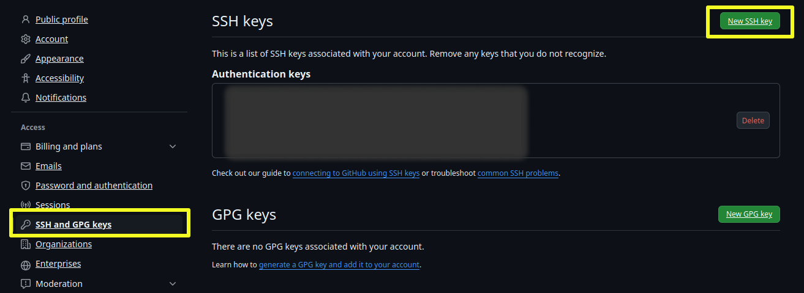

## Setup ssh key github :sleeping:

### 1. Generate a new SSH key

* open terminal
  
```
ssh-keygen -t ed25519 -C "your_email@example.com"
```
> [!NOTE]
> or use rsa
> ```
> ssh-keygen -t rsa -b 4096 -C "your_email@example.com"
>```

### 2. Adding your SSH key to the ssh-agent

**On linux:**

```
eval "$(ssh-agent -s)"
```
* and
```
ssh-add ~/.ssh/id_ed25519
```
> If you created your key with a different name, or if you are adding an existing key that has a different name, replace id_ed25519 in the command with the name of your private key file.

**On windows: / [follow github doc](https://docs.github.com/en/authentication/connecting-to-github-with-ssh/generating-a-new-ssh-key-and-adding-it-to-the-ssh-agent?platform=windows)**

* In a new admin elevated PowerShell window, ensure the ssh-agent is running. You can use the "Auto-launching the ssh-agent" instructions in Working with SSH key passphrases, or start it manually:
```
Get-Service -Name ssh-agent | Set-Service -StartupType Manual
Start-Service ssh-agent
```
* In a terminal window without elevated permissions, add your SSH private key to the ssh-agent. If you created your key with a different name, or if you are adding an existing key that has a different name, replace id_ed25519 in the command with the name of your private key file.
```
ssh-add c:/Users/YOU/.ssh/id_ed25519
```
> Change **c:/Users/YOU/.ssh/id_ed25519** to your path
### 3. Add the SSH public key to your account on GitHub.
* Copy the SSH public key from your clipboard

> copy from file "id_ed25519.pub"

* Open settings on GitHub website
  

### Done :expressionless:

# Resources

* GitHub Docs: [Generating a new SSH key and adding it to the ssh-agent](https://docs.github.com/en/authentication/connecting-to-github-with-ssh/generating-a-new-ssh-key-and-adding-it-to-the-ssh-agent)